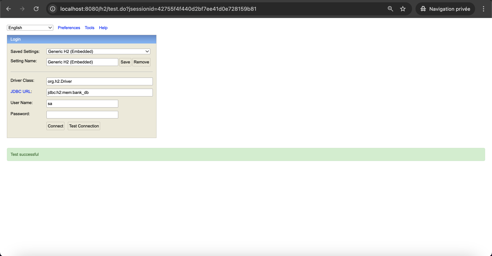
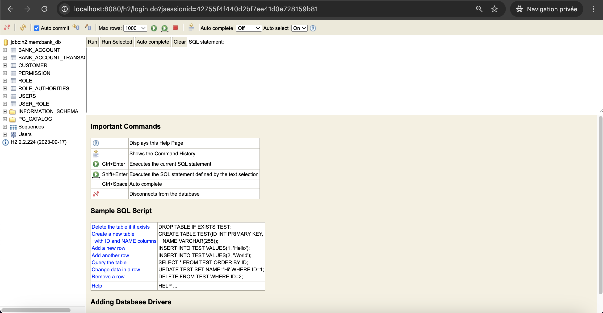
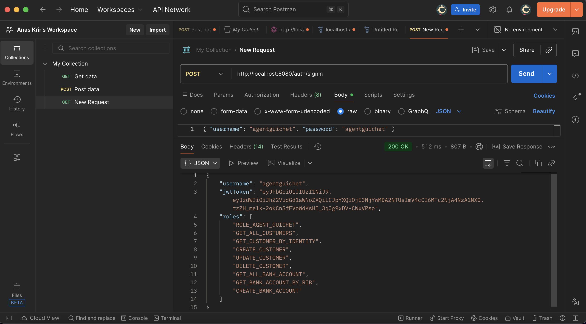
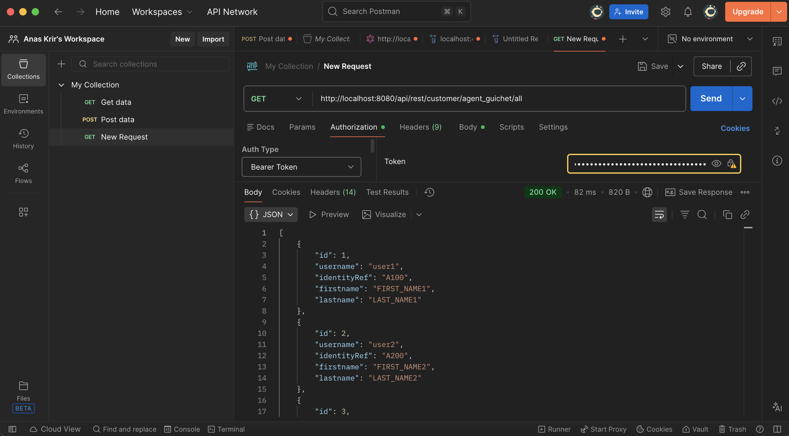
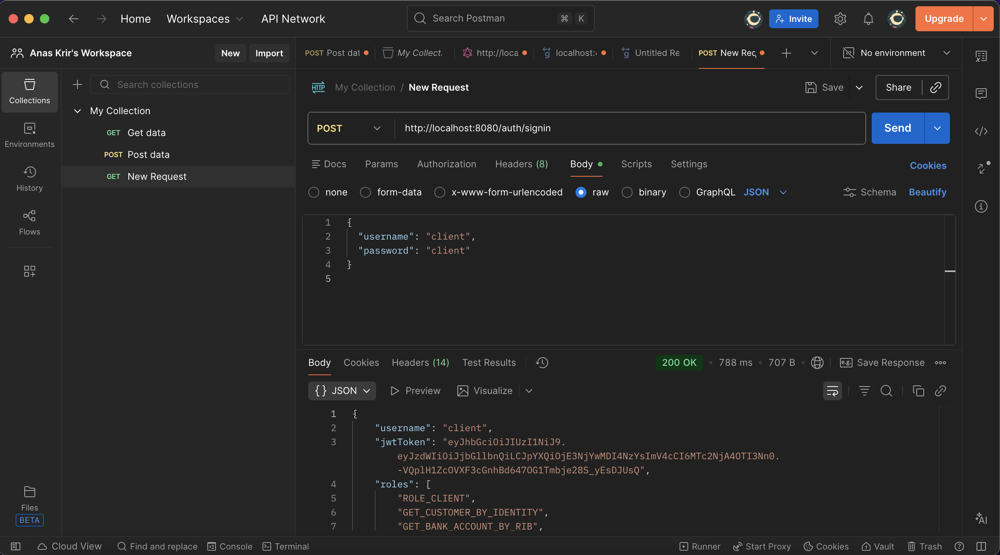
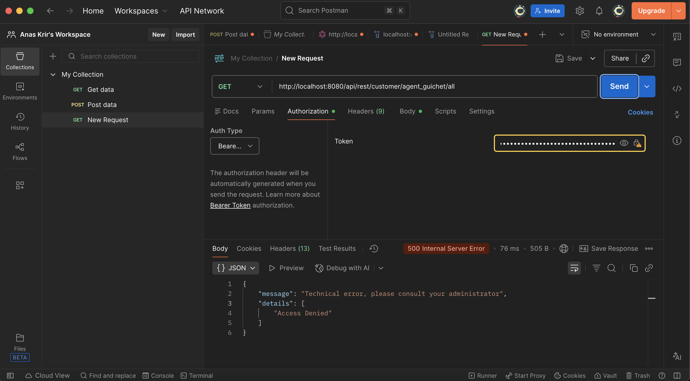

# TP 9 — Web Service Multi-Connecteur Sécurisé (Spring Security & JWT)


Projet du **TP 9 – Web Service Multi-Connecteur Sécurisé**.  
Ce TP est une **évolution du TP7**, avec l’intégration complète de **Spring Security + JWT** afin de sécuriser l’accès aux services exposés.

Les connecteurs implémentés sont :
- **REST sécurisé (JWT + rôles & permissions)**
- **GraphQL**
- **SOAP**
- **gRPC**

---

## 📌 Sommaire

1. [Objectifs du TP](#-objectifs-du-tp)
2. [Concepts clés](#-concepts-clés)
3. [Stack technique](#-stack-technique)
4. [Architecture du projet](#-architecture-du-projet)
5. [Sécurité & Authentification](#-sécurité--authentification)
6. [Services exposés](#-services-exposés)
7. [Démarrage rapide](#-démarrage-rapide)
8. [Tests & démonstrations](#-tests--démonstrations)
9. [Remarques importantes](#-remarques-importantes)
10. [Auteurs](#-auteurs)
11. [Licence](#-licence)

---

## 🎯 Objectifs du TP

- Comprendre le fonctionnement de **Spring Security**
- Mettre en place une **authentification JWT**
- Gérer les **rôles et permissions**
- Sécuriser les endpoints REST
- Conserver une **architecture multi-connecteur**
- Tester les accès autorisés et refusés

---

## 🧠 Concepts clés

### 🔹 JWT (JSON Web Token) <br/>
- Authentification **stateless** <br/>
- Token signé et vérifié à chaque requête <br/>
- Transmission via header `Authorization: Bearer <token>` <br/>

### 🔹 Spring Security <br/>
- Filtre de sécurité personnalisé  <br/>
- Gestion des rôles et permissions <br/>
- Protection fine des endpoints <br/>

### 🔹 REST
- Basé sur HTTP <br/>
- Représentation JSON <br/>
- Sécurisé par JWT <br/>

### 🔹 GraphQL <br/>
- Endpoint unique `/graphql` <br/>
- Requêtes flexibles <br/>

### 🔹 SOAP
- Basé sur XML <br/>
- Contrat formel via WSDL <br/>

### 🔹 gRPC
- RPC moderne basé sur HTTP/2 <br/>
- Sérialisation binaire (Protocol Buffers) <br/>

---

## 🛠️ Stack technique

| Technologie | Version |
|------------|---------|
| Java | 17 |
| Spring Boot | 3.x |
| Spring Security | JWT |
| REST | Spring Web |
| GraphQL | Spring GraphQL |
| SOAP | Spring WS |
| gRPC | grpc-spring-boot-starter |
| H2 Database | In-Memory |
| Maven | ✅ |
| IntelliJ IDEA | Ultimate |
| OS | macOS |

---

## 🏗️ Architecture du projet

```
bank-service-multi-connector-jwt/
├── src/main/java/ma/formations/multiconnector/
│ ├── config/
│ ├── dao/
│ ├── domain/
│ ├── dtos/
│ ├── jwt/
│ ├── security/
│ ├── service/
│ ├── presentation/
│ │ ├── rest/
│ │ ├── graphql/
│ │ ├── soap/
│ │ └── grpc/
│ └── BankServiceMultiConnectorApplication.java
│
├── src/main/resources/
│ ├── application.properties
│ ├── bank.proto
│ └── graphql/
│
├── docs/
│ ├── 1.png
│ ├── 2.png
│ ├── 3.png
│ └── 4.png
| └── 5.png
| └── 6.png
│
├── pom.xml
└── README.md
```


---

## 🔐 Sécurité & Authentification <br/>

### 🔑 Authentification <br/>

**_Endpoint :_**

- POST /auth/signin <br/>

- Payload : <br/>

```
{
  "username": "agentguichet",
  "password": "agentguichet"
}
```

**_Réponse :_** <br/>

- JWT Token <br/>
- Rôles et permissions associées <br/>

#### **_🛡️ Autorisation_**

- Accès contrôlé par rôles & permissions <br/>
- Exemple : <br/>
- ROLE_AGENT_GUICHET → accès autorisé  <br/>
- ROLE_CLIENT → accès refusé (500) <br/>

---

## 🧩 Services exposés <br/>

### 🟦 REST (Sécurisé) <br/>

- Gestion des clients <br/>
- Gestion des comptes bancaires <br/>
- Gestion des transactions <br/>
- Accès protégé par JWT <br/>

### 🟪 GraphQL

- Query customers <br/>
- Query customerByIdentity <br/>
- Mutations CRUD <br/>

### 🟧 SOAP

- Service BankService <br/>
- WSDL généré automatiquement <br/>

### 🟩 gRPC <br/>

- Service BankService <br/>

**_Méthodes :_** <br/>

- customers <br/>
- customerByIdentity <br/>
- bankAccounts <br/>
- addBankAccount <br/>
- addWireTransfer <br/>
- getTransactions <br/>

---

## 🚀 Démarrage rapide <br/>

### 1️⃣ Prérequis <br/>

✅ Java 17 <br/>
✅ Maven <br/>
✅ IntelliJ IDEA (Ultimate) <br/>
✅ Git <br/>

### 2️⃣ Lancer l’application <br/>

**_Depuis IntelliJ IDEA :_** <br/>

```
BankServiceMultiConnectorApplication.java
```

### 3️⃣ Accès H2 <br/>

**_URL :_** <br/>

#### 👉🏻 http://localhost:8080/h2 <br/>

**_JDBC URL :_** <br/>

- jdbc:h2:mem:bank_db <br/>
- User : sa <br/>
- Password : (vide) <br/>

---

## 🔗 Tests & démonstrations <br/>


### 🟢 H2 Database <br/>

#### ✅ Connexion réussi <br/>

| H2 Database     |
|-----------------|
|  |
|  |

### 🔐 Authentification JWT (Postman) <br/>

#### ✅ Accès autorisé (ROLE_AGENT_GUICHET) <br/>

```
GET http://localhost:8080/api/rest/customer/agent_guichet/all
Authorization: Bearer <JWT>
```

| Authentification JWT (Postman) | Accès autorisé    |
|--------------------------------| ----------------|
|                 | |


### ❌ Accès refusé (ROLE_CLIENT → 500) <br/>

#### Même endpoint avec un utilisateur client. <br/>

| Accès refusé    |
|-----------------|
|  |
|  |

---

## ⚠️ Remarques importantes <br/>

- Sécurité stateless (JWT) <br/>
- Aucun stockage de session <br/>
- H2 en mémoire pour les tests  <br/>
- REST sécurisé, autres connecteurs conservés <br/>
- Architecture claire et modulaire  <br/>

---

## 👥 Auteurs

Anas KRIR & Adam EL YOURI <br/>
Étudiants Ingénieurs — MIAGE <br/>

TP réalisé dans le cadre du module : ARCHITECTURE DES COMPOSANTS D’ENTREPRISES <br/>

Technologies : <br/>
Java · Spring Boot · Spring Security · JWT · REST · GraphQL · SOAP · gRPC · Maven <br/>


---

## 📄 Licence

✅ Projet sous licence MIT<br/>
Libre d’utilisation à des fins pédagogiques. <br/>

© 2025 — Anas KRIR & Adam EL YOURI <br/>

---